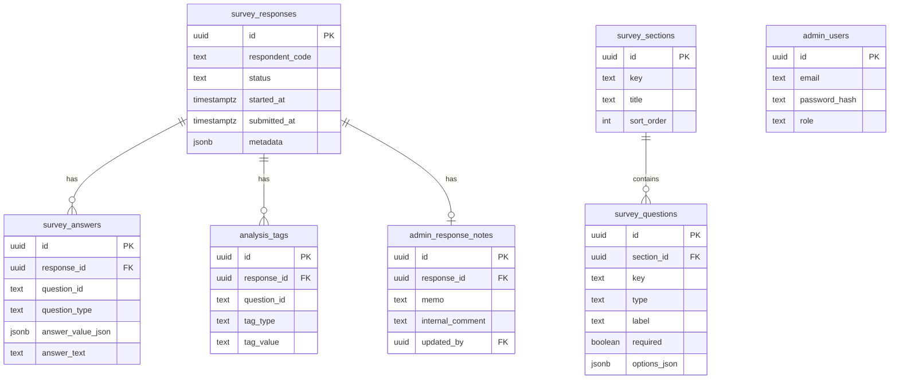

# UniDrop Tester Survey

UniDrop のクローズドテスト参加者向けアンケートサイトです。  
公開フォーム、回答保存、管理画面、CSV 出力、自由記述分析まで含めて、GitHub に push して Vercel にそのまま載せられる構成で実装しています。

## プロジェクト概要

このサイトの目的は、UniDrop のテスターから「ぶっちゃけた本音」と「改善に直結する構造化データ」を集めることです。単なる満足度フォームではなく、以下の仮説検証を重視しています。

- 価値観診断という入口で警戒心が下がるか
- 55 問診断を最後までやれるか
- Drop の第一印象でワクワクが起きるか
- 相性スコアと 3 つの理由に納得感があるか
- 顔写真なし / 筑波限定 / ニックネーム制が安心感につながるか
- チャットの最初の 1 通が送りやすいか
- 友達に勧められるか
- このままだと広がらない理由は何か

## 技術スタック

- Next.js 15 App Router
- TypeScript
- Tailwind CSS
- shadcn/ui 互換の UI 構成
- Lucide Icons
- React Hook Form
- Zod
- PostgreSQL
- `postgres` client
- `jose` による管理画面セッション
- Recharts
- date-fns
- Sonner

Supabase を使う場合は、Supabase Postgres の接続文字列を `DATABASE_URL` に入れるだけで運用できます。

## 主な機能

- 公開トップページ `/`
- 公開アンケートフォーム `/survey`
- 回答完了ページ `/survey/complete`
- セクション単位保存
- 途中離脱後の再開
- 送信前の確認画面
- 回答完了画面
- 管理画面ログイン `/admin/login`
- ダッシュボード `/admin`
- 回答一覧 `/admin/responses`
- 回答詳細 `/admin/responses/[id]`
- 自由記述分析 `/admin/analysis`
- ローデータ CSV / 分析用 CSV 出力
- 手動タグ付け
- 管理メモ / 内部コメント
- SEO 対応の `robots.txt` / `sitemap.xml` / metadata
- 404 / loading / error UI

## 必要環境

- Node.js 22 LTS 推奨
- npm 10 以上推奨
- PostgreSQL 15 以上推奨

`.nvmrc` と `.node-version` は `22` に合わせています。Vercel でも Node 22 を使う前提です。

## ディレクトリ構成

```text
.
├── components.json
├── db
│   └── migrations
│       └── 0001_initial.sql
├── scripts
│   └── seed.ts
├── src
│   ├── app
│   │   ├── admin
│   │   │   ├── (protected)
│   │   │   └── login
│   │   ├── api
│   │   └── survey
│   ├── components
│   │   ├── admin
│   │   ├── providers
│   │   ├── shared
│   │   ├── survey
│   │   └── ui
│   ├── config
│   │   └── survey.ts
│   ├── lib
│   │   ├── analytics.ts
│   │   ├── export.ts
│   │   ├── free-text.ts
│   │   ├── survey-store.ts
│   │   └── validation.ts
│   └── types
│       └── modules.d.ts
├── .env.example
├── next.config.ts
├── package.json
├── tailwind.config.ts
└── tsconfig.json
```

## ローカル起動方法

1. 依存関係をインストールします。

```bash
npm install
```

2. 環境変数を設定します。

```bash
cp .env.example .env.local
```

3. DB マイグレーションを適用します。

```bash
psql "$DATABASE_URL" -f db/migrations/0001_initial.sql
```

4. seed データを投入します。

```bash
npm run seed
```

5. 開発サーバーを起動します。

```bash
npm run dev
```

6. 必要な検証コマンドを実行します。

```bash
npm run lint
npm run typecheck
npm run build
```

公開フォームは `http://localhost:3000/survey`、管理画面ログインは `http://localhost:3000/admin/login` です。

## 環境変数一覧

`.env.example` に含めている値:

- `DATABASE_URL`
  - PostgreSQL 接続文字列
  - Supabase Postgres を使う場合もここに入れます
- `NEXT_PUBLIC_SITE_URL`
  - 公開 URL
  - 例: `https://unidrop-survey.vercel.app`
- `ADMIN_SESSION_SECRET`
  - 管理画面セッション署名用の長いランダム文字列
- `ADMIN_SEED_EMAIL`
  - seed 時に作成する管理者メールアドレス
- `ADMIN_SEED_PASSWORD`
  - seed 時に作成する管理者パスワード

## DB セットアップ

### テーブル

最低限の主要テーブル:

- `survey_responses`
- `survey_sections`
- `survey_questions`
- `survey_answers`
- `admin_users`
- `analysis_tags`
- `admin_response_notes`

### マイグレーション

```bash
psql "$DATABASE_URL" -f db/migrations/0001_initial.sql
```

### seed データ投入方法

```bash
npm run seed
```

投入されるもの:

- 質問定義
- 管理者 1 件
- サンプル回答 20 件
- ダッシュボード確認用のダミーデータ
- 一部の初期タグ

## GitHub に push する手順

1. Git 初期化または既存リポジトリを確認します。

```bash
git init
git add .
git commit -m "Initial UniDrop tester survey app"
```

2. GitHub に新しい repository を作成します。

3. remote を追加して push します。

```bash
git remote add origin <YOUR_GITHUB_REPO_URL>
git branch -M main
git push -u origin main
```

## Vercel デプロイ手順

1. Vercel で GitHub repository を Import します。
2. Framework Preset は Next.js のままで問題ありません。
3. Environment Variables に以下を設定します。
   - `DATABASE_URL`
   - `NEXT_PUBLIC_SITE_URL`
   - `ADMIN_SESSION_SECRET`
   - `ADMIN_SEED_EMAIL`
   - `ADMIN_SEED_PASSWORD`
4. Build Command はデフォルトの `next build` を使います。
5. Node.js Version は `22.x` を選びます。
6. デプロイ後、DB に対してマイグレーションと seed を実行します。

### 推奨運用

- DB: Supabase Postgres か外部 PostgreSQL
- Hosting: Vercel
- 公開 URL:
  - `/` トップ
  - `/survey` 回答フォーム
  - `/admin/login` 管理ログイン

### Preview / Production

- Preview 環境でも同じコードでビルドできます
- `NEXT_PUBLIC_SITE_URL` は Production URL に合わせるのが基本です
- Preview では canonical / sitemap が preview URL を指さないよう、本番運用時は Production 環境変数を必ず更新してください

## 管理画面への入り方

1. `npm run seed` 実行後、`.env.local` の以下でログインできます。
   - `ADMIN_SEED_EMAIL`
   - `ADMIN_SEED_PASSWORD`
2. ログイン URL は `/admin/login` です。
3. 認証済みセッションがない状態で `/admin` に入ると `/admin/login` へリダイレクトされます。

## 画面一覧

- `/`
- `/survey`
- `/survey/complete`
- `/admin/login`
- `/admin`
- `/admin/responses`
- `/admin/responses/[id]`
- `/admin/analysis`

## 主要 API / Route Handlers 一覧

- `GET /api/health`
- `GET /api/survey/session`
- `POST /api/survey/section`
- `POST /api/survey/submit`
- `POST /api/admin/auth/login`
- `POST /api/admin/auth/logout`
- `POST /api/admin/tags`
- `DELETE /api/admin/tags`
- `POST /api/admin/notes`
- `GET /api/admin/export/raw`
- `GET /api/admin/export/analysis`

## フォーム定義の編集方法

フォーム定義の source of truth は `src/config/survey.ts` です。
筑波大学の学類・委員会・サークル候補は `src/data/tsukuba-directory.ts` にまとめています。

### 質問文を変更する

- `surveySections` 内の `label`
- `helperText`
- `placeholder`
- `options`

### 質問を追加する

1. 対応する section の `questions` に object を追加します
2. `id`, `type`, `required`, `label` を設定します
3. 必要なら `helperText`, `options`, `placeholder`, `rows` も設定します
4. `npm run seed` を再実行して DB 側定義を更新します

## 集計ロジックの追加方法

集計ロジックは回答保存処理と分離しています。

- 回答ロード: `src/lib/survey-store.ts`
- スコア算出: `src/lib/analytics.ts`
- 自由記述分析: `src/lib/free-text.ts`
- CSV 出力: `src/lib/export.ts`

新しい分析指標を足す手順:

1. `computeResponseScores` にスコアを追加
2. `buildDashboardData` に集計値を追加
3. 必要なら `buildResponseSummary` に一覧表示用の列を追加
4. `buildAnalysisCsv` に列を追加

## ER 図の説明



ポイント:

- `survey_responses` は回答セッション単位
- `survey_answers` は設問単位の柔軟な保存
- `analysis_tags` は自由記述の後付け分析
- `admin_response_notes` は管理メモと内部コメント
- `metadata` はセクション進捗と離脱分析用

## 主要コンポーネント一覧

- `SurveyExperience`
- `RadioGroupQuestion`
- `CheckboxQuestion`
- `LikertScaleQuestion`
- `NpsQuestion`
- `TextareaQuestion`
- `ShortTextQuestion`
- `SectionIntro`
- `ProgressHeader`
- `StickyNavigation`
- `ConfirmationScreen`
- `DashboardCharts`
- `ResponsesTable`
- `TagEditor`
- `ResponseNotesEditor`
- `KeywordHighlighter`
- `EmptyState`
- `ToastProvider`

## 今回の設計で分析しやすくした工夫 5 点

1. 質問定義を `src/config/survey.ts` に集約し、UI と seed と分析のズレを避けています。
2. 回答を `survey_responses` と `survey_answers` に分け、設問追加時のスキーマ変更を最小化しています。
3. `answer_value_json` を採用し、単一選択・複数選択・自由記述・数値を同じ保存モデルで扱っています。
4. `metadata.completedSectionKeys` と section 更新時刻を保持し、離脱率や再開状況を追えるようにしています。
5. 自由記述タグと管理メモを別構造に分離し、分析の補助情報を後付けできるようにしています。

## 今後の拡張案

- Supabase Auth 連携
- RLS を使った管理画面保護
- 日本語形態素解析の本格導入
- 類似コメントのクラスタリング
- cohort 比較
- 複数アンケートの切り替え対応
- 回答期間ごとの比較ビュー

## 備考

- 管理画面と完了画面は `noindex` です
- 公開トップには `robots.txt`, `sitemap.xml`, OG metadata, JSON-LD を設定済みです
- Vercel では GitHub 連携後、そのまま `next build` でデプロイできる構成です
