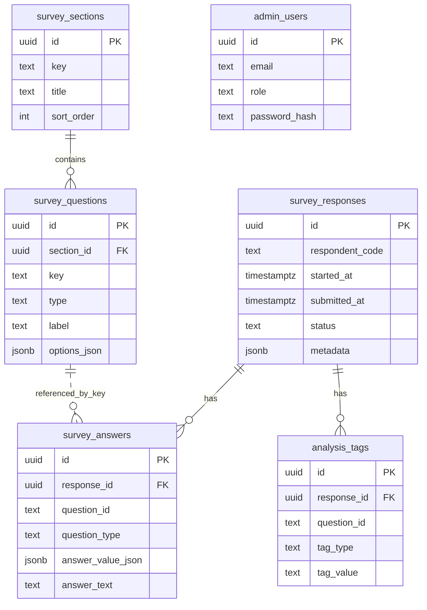

# UniDrop Tester Survey

UniDrop のクローズドテスト参加者向けアンケートサイトです。  
目的は、静かなブランドトーンを保ちながら、以下の仮説を検証できる構造化データと本音の自由記述を集めることです。

- 価値観診断の入口で警戒心が下がるか
- 55問診断を最後までやりきれるか
- Drop 到着時にワクワクが起きるか
- 相性スコアと理由に納得感があるか
- 顔写真なし / 筑波大限定 / ニックネーム制が安心感につながるか
- チャット初手が送りやすいか
- 友達に勧めたくなるか
- 広がらない根本要因は何か

## 技術スタック

- Next.js App Router
- TypeScript
- Tailwind CSS
- shadcn/ui 風の再利用コンポーネント
- PostgreSQL 想定
- `postgres` クライアント
- custom JWT session auth (`jose`)
- Recharts

## 主な機能

- 回答者向けセクション式フォーム
- セクション単位の保存と再開
- 送信前の確認画面
- 回答完了画面
- 管理者ログイン
- 管理ダッシュボード
- 回答一覧 / 回答詳細
- CSV エクスポート
- 自由記述のキーワード抽出 / 簡易感情分類 / 手動タグ付け
- 主要分析スコアの自動算出

## 画面一覧

- `/survey` 回答フォーム
- `/survey/complete` 回答完了
- `/admin/login` 管理ログイン
- `/admin` ダッシュボード
- `/admin/responses` 回答一覧
- `/admin/responses/[id]` 回答詳細
- `/admin/analysis` 自由記述分析

## セットアップ

1. 依存関係を入れます。

```bash
npm install
```

2. 環境変数を設定します。

```bash
cp .env.example .env.local
```

3. PostgreSQL にマイグレーションを適用します。

```bash
psql "$DATABASE_URL" -f db/migrations/0001_initial.sql
```

4. 質問定義・管理者・サンプル回答を投入します。

```bash
npm run seed
```

5. 開発サーバーを起動します。

```bash
npm run dev
```

## 起動方法

```bash
npm run dev
```

ブラウザで `http://localhost:3000/survey` を開いてください。  
管理画面は `http://localhost:3000/admin/login` です。

## 環境変数

- `DATABASE_URL`: PostgreSQL 接続文字列
- `NEXT_PUBLIC_SITE_URL`: 本番公開 URL。`https://example.com` の形式で設定
- `ADMIN_SESSION_SECRET`: 管理画面セッション署名キー
- `ADMIN_SEED_EMAIL`: seed 時に作る管理者メールアドレス
- `ADMIN_SEED_PASSWORD`: seed 時に作る管理者パスワード

## GitHub への push と本番デプロイ

このアプリはサーバー保存と管理認証を含むため、GitHub Pages では動きません。  
GitHub に push し、Vercel / Railway / Render などの Node.js + PostgreSQL 対応ホスティングへつなぐ前提です。最も簡単なのは GitHub 連携の Vercel です。

推奨フロー:

1. GitHub にこのリポジトリを push
2. Vercel で GitHub リポジトリを Import
3. `DATABASE_URL`, `NEXT_PUBLIC_SITE_URL`, `ADMIN_SESSION_SECRET`, `ADMIN_SEED_EMAIL`, `ADMIN_SEED_PASSWORD` を設定
4. PostgreSQL に [db/migrations/0001_initial.sql](/Users/onoe/Desktop/UniDroptools/db/migrations/0001_initial.sql) を適用
5. 初回だけ `npm run seed` を本番 DB に対して実行
6. `NEXT_PUBLIC_SITE_URL` を実際の公開 URL に更新して再デプロイ

`next.config.ts` は `output: "standalone"` を有効にしてあるので、Vercel 以外にも載せやすい構成です。

## 検索で表示される状態にするための対応

実装済み:

- 公開トップページを追加
- `robots.txt` を生成: [src/app/robots.ts](/Users/onoe/Desktop/UniDroptools/src/app/robots.ts)
- `sitemap.xml` を生成: [src/app/sitemap.ts](/Users/onoe/Desktop/UniDroptools/src/app/sitemap.ts)
- canonical / Open Graph / description を設定
- admin 配下と完了画面は `noindex`
- WebSite 構造化データをトップページに埋め込み

公開後にやること:

1. 独自ドメインまたは公開 URL を確定
2. `NEXT_PUBLIC_SITE_URL` を本番 URL に設定
3. Google Search Console にサイトを登録
4. `https://<your-domain>/sitemap.xml` を送信
5. 公開トップがクロール可能か確認

## DB セットアップ

- マイグレーション: [db/migrations/0001_initial.sql](/Users/onoe/Desktop/UniDroptools/db/migrations/0001_initial.sql)
- seed: [scripts/seed.ts](/Users/onoe/Desktop/UniDroptools/scripts/seed.ts)
- 開発用ダミーデータ: 20 件の回答、複数ペルソナ、途中保存データ、初期タグ付き

## 管理画面ログイン方法

seed 実行後、以下でログインできます。

- メールアドレス: `.env.local` の `ADMIN_SEED_EMAIL`
- パスワード: `.env.local` の `ADMIN_SEED_PASSWORD`

`.env.local` を変えていなければ初期値は `admin@unidrop.local / changeme123` です。

## フォーム定義の編集方法

質問定義は [src/config/survey.ts](/Users/onoe/Desktop/UniDroptools/src/config/survey.ts) を source of truth にしています。

- セクション追加: `surveySections` に section object を追加
- 設問追加: 該当 section の `questions` に question object を追加
- UI 反映: `SurveyQuestionRenderer` が `type` ごとに描画
- seed 反映: `npm run seed` を再実行

各設問は `id`, `type`, `required`, `label`, `helperText`, `options` を基本に持ち、必要に応じて `placeholder`, `maxSelections`, `scaleLabels` などを拡張しています。

## 集計ロジックの追加方法

集計は回答保存ロジックから分離しています。

- 生回答ロード: [src/lib/survey-store.ts](/Users/onoe/Desktop/UniDroptools/src/lib/survey-store.ts)
- 指標計算: [src/lib/analytics.ts](/Users/onoe/Desktop/UniDroptools/src/lib/analytics.ts)
- 自由記述分析: [src/lib/free-text.ts](/Users/onoe/Desktop/UniDroptools/src/lib/free-text.ts)
- CSV 整形: [src/lib/export.ts](/Users/onoe/Desktop/UniDroptools/src/lib/export.ts)

新しいスコアを追加する手順:

1. `computeResponseScores` に計算式を追加
2. ダッシュボード表示が必要なら `buildDashboardData` に集約
3. 一覧表示が必要なら `buildResponseSummary` に反映
4. CSV に必要なら `buildAnalysisCsv` に列追加

## ディレクトリ構成

```text
.
├── db
│   └── migrations
│       └── 0001_initial.sql
├── scripts
│   └── seed.ts
├── src
│   ├── app
│   │   ├── admin
│   │   │   ├── (protected)
│   │   │   └── login
│   │   ├── api
│   │   └── survey
│   ├── components
│   │   ├── admin
│   │   ├── survey
│   │   └── ui
│   ├── config
│   │   └── survey.ts
│   ├── lib
│   │   ├── analytics.ts
│   │   ├── free-text.ts
│   │   ├── survey-store.ts
│   │   └── ...
│   └── types
│       └── modules.d.ts
├── .env.example
└── README.md
```

## 設計概要

- `src/config/survey.ts` をフォーム定義の単一ソースにして、画面・seed・分析で再利用
- 回答保存は `survey_responses` と `survey_answers` に分離し、回答スキーマの拡張を容易化
- 管理画面は `survey-store` でロードした生データを `analytics.ts` で集計
- 自由記述の補助分析は辞書ベースのタグ候補、キーワード抽出、簡易感情分類で実装
- 管理認証は `admin_users` + signed cookie session
- 公開トップ、`robots.txt`、`sitemap.xml`、metadata を追加し、本番公開と検索流入に対応

## ER 図の説明



ER のポイント:

- `survey_responses` は回答セッション単位
- `survey_answers` は設問単位で 1 レコードずつ保存
- `survey_questions` は DB にも保持し、将来のアンケート差し替えに備える
- `analysis_tags` は自由記述の後付け分析を保存
- `metadata` に section progress を持たせて離脱分析に使う

## 主要コンポーネント一覧

- `SurveyExperience`: 回答フロー全体の状態管理
- `RadioGroupQuestion`
- `CheckboxQuestion`
- `LikertScaleQuestion`
- `NpsQuestion`
- `TextareaQuestion`
- `ShortTextQuestion`
- `SectionIntro`
- `ProgressHeader`
- `StickyNavigation`
- `ConfirmationScreen`
- `DashboardCharts`
- `ResponsesTable`
- `TagEditor`
- `KeywordHighlighter`

## 特に分析しやすくした工夫 5 点

1. 回答本体と分析ロジックを分離し、指標追加を `analytics.ts` だけで完結しやすくした
2. `survey_answers.answer_value_json` を採用し、単一選択・複数選択・数値・自由記述を同一テーブルで扱えるようにした
3. `metadata.completedSectionKeys` を保存し、セクション別離脱率と再開状況を追えるようにした
4. 自由記述に `analysis_tags` を別テーブルで持たせ、手動タグと自動候補を共存できるようにした
5. 分析用 CSV を 1回答1行 + スコア列 + タグ列で出せるようにし、外部分析へ渡しやすくした

## 今後の拡張案

- Supabase Auth / RLS 連携
- 日本語形態素解析の本格導入
- 類似コメントのクラスタリング
- 回答比較ビュー
- テスター cohort ごとの時系列比較
- 本番回答とテスター回答のアンケート定義切り替え
